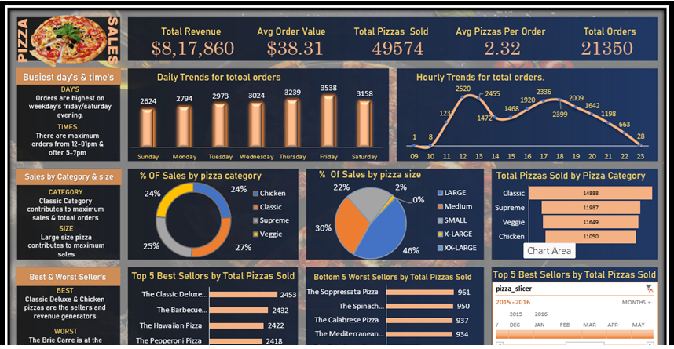

# Pizza Sales Dashboard — SQL + Excel Project

## Project Overview
- Tools Used: SQL Server + Microsoft Excel
- Dataset: Pizza Sales Data (2015)
- Status: Completed ✅
- Total Records: 48,620 rows

## Problem Statement
Analyze pizza sales data to identify key
business metrics, sales trends, and
performance patterns to help the pizza
business make better data-driven decisions.

## Dashboard KPIs

| KPI | Value |
|-----|-------|
| Total Revenue | $8,17,860 |
| Average Order Value | $38.31 |
| Total Pizzas Sold | 49,574 |
| Avg Pizzas Per Order | 2.32 |
| Total Orders | 21,350 |

## SQL Queries Built
All business questions were first solved
in SQL Server before building the dashboard:

### Basic KPIs
- Q1 Total Revenue
- Q2 Average Order Value
- Q3 Total Pizzas Sold
- Q4 Total Orders Placed
- Q5 Average Pizzas Per Order

### Chart Requirement Queries
- Daily Trend for Total Orders
- Hourly Trend for Total Orders
- Percentage of Sales by Pizza Category
- Percentage of Sales by Pizza Size
- Total Pizzas Sold per Category
- Top 5 Best Sellers by Pizzas Sold
- Bottom 5 Sellers by Pizzas Sold

## Dashboard Charts Built

### Row 1 - Trends
- Daily Trends Bar Chart
  (Orders by day Sunday to Saturday)
- Hourly Trends Line Chart
  (Orders by hour 9am to 11pm)

### Row 2 - Category and Size Analysis
- % of Sales by Pizza Category (Donut Chart)
- % of Sales by Pizza Size (Donut Chart)
- Total Pizzas Sold by Category (Bar Chart)

### Row 3 - Best and Worst Performers
- Top 5 Best Sellers by Total Pizzas Sold
- Bottom 5 Worst Sellers by Total Pizzas Sold
- Timeline Slicer for Month Year filtering

## Key Business Insights

### Busiest Days
- Friday has highest orders = 3,538
- Saturday is second highest = 3,158
- Sunday has lowest orders = 2,624
- Weekends drive most pizza business

### Busiest Hours
- Peak hour = 12pm with 2,520 orders
- Second peak = 6pm with 2,336 orders
- Dead hours = 9am with only 1 order
- Business is lunch and dinner driven

### Category Insights
- Classic Category contributes maximum
  sales and total orders (26%)
- Chicken category contributes 24%
- Supreme category contributes 25%
- Veggie category contributes 24%

### Size Insights
- Large size contributes 46% of sales
- Medium size contributes 30% of sales
- Small size contributes 22% of sales
- XL and XXL have minimal contribution

### Best Sellers
- The Classic Deluxe Pizza = 2,453 sold
- The Barbecue Chicken Pizza = 2,432 sold
- The Hawaiian Pizza = 2,422 sold

### Worst Sellers
- The Brie Carre Pizza = 490 sold
- The Mediterranean Pizza = 934 sold
- The Calabrese Pizza = 937 sold

## Excel Skills Used
- Pivot Tables and Pivot Charts
- VLOOKUP and XLOOKUP formulas
- 1/COUNT trick for accurate order counting
- Donut Charts and Bar Charts
- Line Charts for trend analysis
- Timeline Slicer for date filtering
- Dark theme professional dashboard design
- KPI card formatting
- Insights text boxes with key findings

## SQL Skills Used
- COUNT DISTINCT for unique order counting
- GROUP BY with DATEPART for time analysis
- FORMAT for day name extraction
- Window Functions for percentage calculation
- CAST for float division accuracy
- RANK for top and bottom analysis
- CTE for clean query structure

## Files in This Project
- Pizza-Sales-Dashboard.xlsx = Full Excel dashboard
- data/pizza_sales.csv = Raw pizza sales dataset
- dashboard-preview.png = Dashboard screenshot
- README.md = Project description

## How to Use
1. Download pizza_sales.csv from data folder
2. Import into SQL Server and run SQL queries
3. Open Pizza-Sales-Dashboard.xlsx in Excel
4. Use the Timeline Slicer to filter by month
5. All charts update automatically with slicer