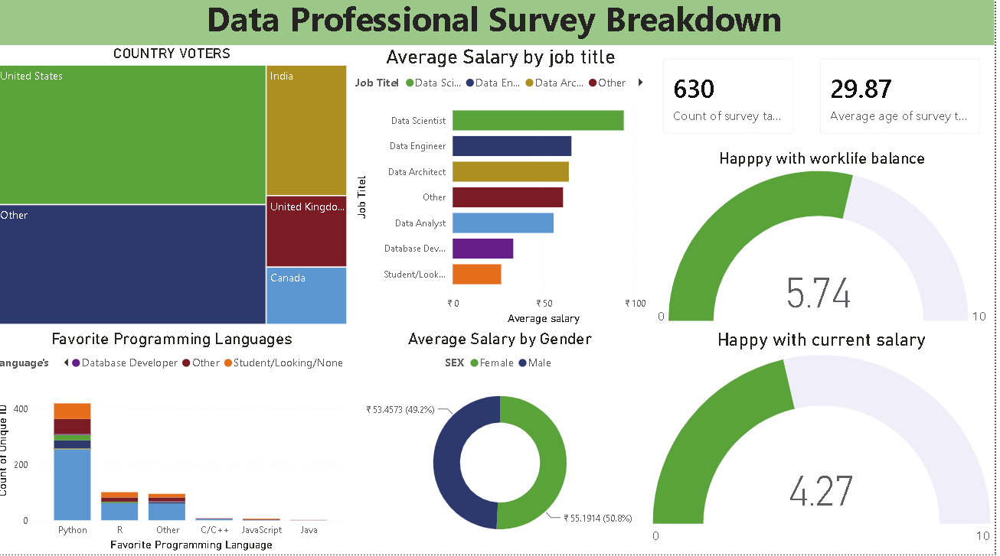

# Data Professional Survey Breakdown
## Power BI Project — Paras Shukla

## Overview
- Tool: Power BI Desktop
- Status: Completed
- Dataset: Data Professional Survey (630 respondents)

## Dashboard KPIs
| KPI | Value |
|-----|-------|
| Total Survey Takers | 630 |
| Average Age | 29.87 years |
| Work-Life Satisfaction | 5.74 / 10 |
| Salary Satisfaction | 4.27 / 10 |

## Key Insights
- Python is the most preferred language
- Data Scientists earn highest average salary
- Salary satisfaction is low at 4.27 out of 10
- United States has most respondents
- Small gender pay gap exists in the data field

## Visuals Built
- KPI Cards, Stacked Bar Chart, Stacked Column Chart
- Tree Map, Gauge Charts, Donut Chart

## Files
- data-professional-survey.pbix = Power BI file
- data/survey-data.xlsx = Raw dataset
- dashboard-preview.png = Dashboard screenshot